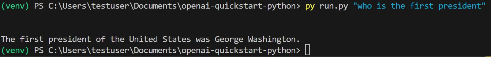

# openai-quickstart-python

This is forked from the openai repo: https://github.com/openai/openai-quickstart-python

Commands to run on Windows:

1. py -3.11 -m venv venv
2. Set-ExecutionPolicy -ExecutionPolicy Unrestricted -Scope Process
3. .\venv\Scripts\activate
4. pip install requirements.txt
5. py run.py "who is the first president"